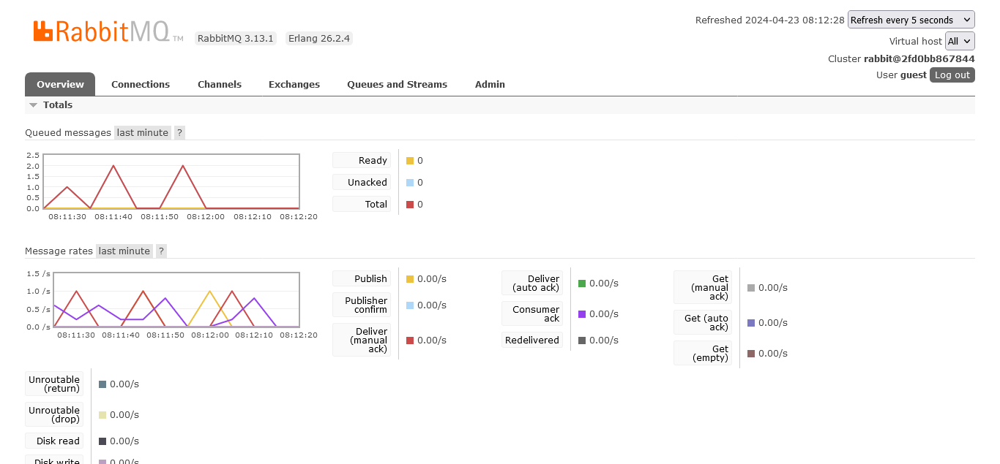

a. AMQP adalah singkatan dari Advanced Message Queuing Protocol. Ini adalah protokol application layer untuk middleware berorientasi pesan. AMQP dirancang untuk mendukung berbagai pola komunikasi pesan secara efisien.

b. guest:guest@localhost:5672 adalah string yang berisi informasi untuk melakukan koneksi ke database. guest:guest adalah kredensial default untuk masuk ke server RabbitMQ. guest pertama adalah username dan guest kedua adalah password. localhost adalah hostname dari server RabbitMQ. Ini berarti server RabbitMQ berjalan secara lokal. 5672 adalah port default yang digunakan RabbitMQ untuk komunikasi.

The total number in my machine is 2. This is because I cannot rerun the publisher program quickly after it ends as it will make my computer freeze and lag. I have to give a little pause after each run. However, I think I can see the slow simulation of the subscriber program.

