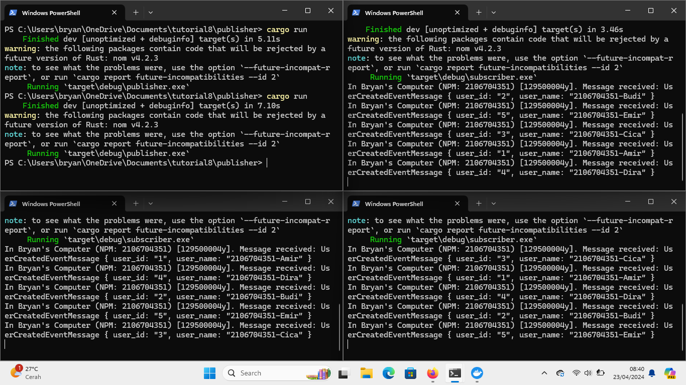
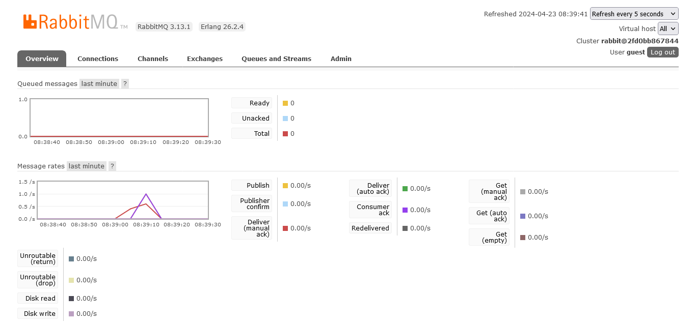

a. AMQP adalah singkatan dari Advanced Message Queuing Protocol. Ini adalah protokol application layer untuk middleware berorientasi pesan. AMQP dirancang untuk mendukung berbagai pola komunikasi pesan secara efisien.

b. guest:guest@localhost:5672 adalah string yang berisi informasi untuk melakukan koneksi ke database. guest:guest adalah kredensial default untuk masuk ke server RabbitMQ. guest pertama adalah username dan guest kedua adalah password. localhost adalah hostname dari server RabbitMQ. Ini berarti server RabbitMQ berjalan secara lokal. 5672 adalah port default yang digunakan RabbitMQ untuk komunikasi.

The total number in my machine is 2. This is because I cannot rerun the publisher program quickly after it ends as it will make my computer freeze and lag. I have to give a little pause after each run. However, I think I can see the slow simulation of the subscriber program.

Ketika tiga console menjalankan program subscriber secara simultan, antrian pesan di RabbitMQ berkurang lebih cepat karena pesan dikonsumsi lebih cepat. Di komputer saya, antrian pesan tampaknya kosong. Hal ini disebabkan oleh program publisher yang tidak dapat mengisi antrian pesan dengan cepat, sementara subscriber mengkonsumsi pesan tersebut lebih cepat.

**Perbaikan kode**

Beberapa peningkatan yang bisa dilakukan adalah:

1. Menambahkan lebih banyak _error handling_ dan _log_ untuk memudahkan _debugging_ dan _maintainance_.
2. Menerapkan logika bisnis dalam `MessageHandler`, bukan hanya mencetak pesan.
3. Gunakan konfigurasi atau _environment variabel_ untuk URL AMQP, daripada melakukan _hard code_.
